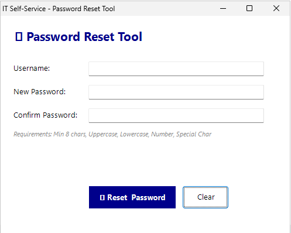
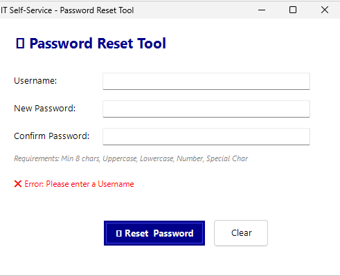
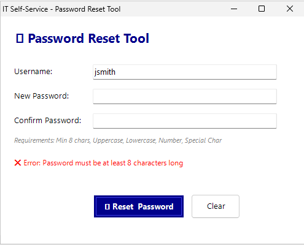
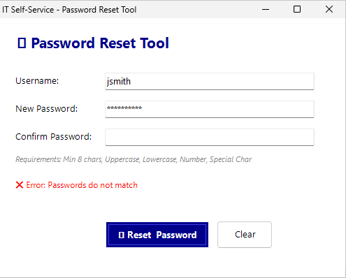
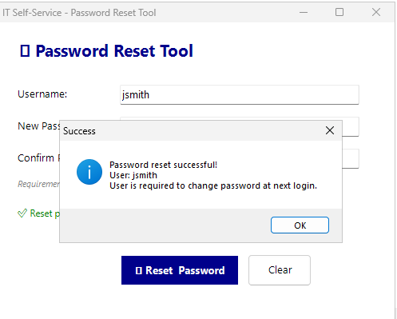
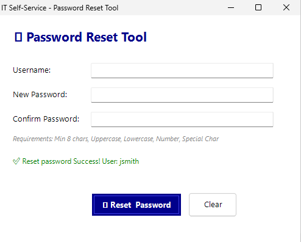
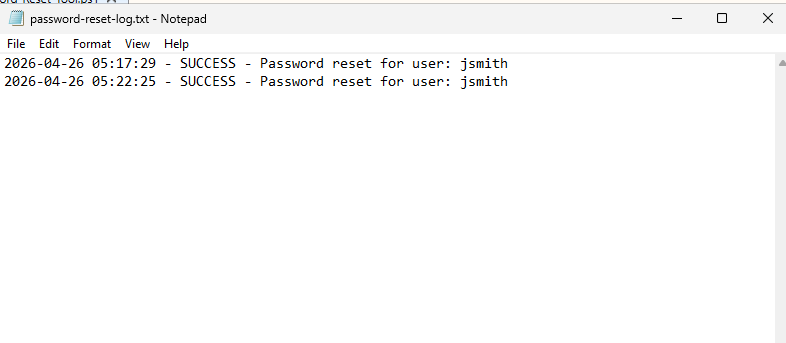

# 🔐 Lab 3: Password Reset Self-Service Tool

> **PowerShell GUI tool** for IT Helpdesk and End Users — reset passwords in under 30 seconds and reduce IT team workload by up to 70%

---

## 📋 Table of Contents

- [Overview](#-overview)
- [Features](#-features)
- [Technologies](#-technologies)
- [Getting Started](#-getting-started)
- [Usage](#-usage)
- [Screenshots](#-screenshots)
- [Business Value](#-business-value)
- [File Structure](#-file-structure)
- [Video Demo](#-video-demo)

---

## 🎯 Overview

Lab 3 is part of an IT Automation project series. It delivers a **Password Reset Self-Service Tool** that enables IT Helpdesk staff and end users to reset passwords through a GUI — quickly, securely, and with a full audit trail.

**Problems solved:**
- IT team spending 10+ minutes per ticket on password resets
- Password resets accounting for the majority of monthly helpdesk tickets
- No reset logs → no audit capability
- Users setting weak or reused passwords with no enforcement

---

## ✅ Features

| Feature | Description |
|---|---|
| 🖥️ **User-Friendly GUI** | Windows Forms interface — no PowerShell knowledge required |
| 🔒 **Password Complexity Validation** | Real-time checks for length, uppercase, lowercase, numbers, and special characters |
| ✔️ **Confirm Password Matching** | Instant alert if the confirmation password does not match |
| 📡 **Real-Time Status Feedback** | Step-by-step status display with color-coded indicators |
| 📝 **Activity Logging** | Every reset event is logged: timestamp, username, admin, and result |
| ⚠️ **Error Handling** | Graceful handling of AD unreachable, user not found, and permission denied errors |
| 🔄 **Force Password Change** | Option to require users to change their password on next login |

---

## 🛠️ Technologies

```
PowerShell 5.1+
├── Windows Forms (System.Windows.Forms)     → GUI Framework
├── Active Directory Module (RSAT)           → AD Integration
└── Logging System (custom)                  → Audit Trail
```

**Requirements:**
- Windows 10/11 or Windows Server 2016+
- RSAT: Active Directory Domain Services Tools
- Domain Admin rights or Delegated Password Reset permission

---

## 🚀 Getting Started

### 1. Clone or Download

```powershell
git clone https://github.com/SuriyaBoon/home-lab-v3.git
cd home-lab-v3
```

### 2. Verify Prerequisites

```powershell
# Check for AD Module
Get-Module -ListAvailable -Name ActiveDirectory

# Install RSAT if not present (Windows 10/11)
Add-WindowsCapability -Online -Name Rsat.ActiveDirectory.DS-LDS.Tools~~~~0.0.1.0
```

### 3. Set Execution Policy

```powershell
Set-ExecutionPolicy -ExecutionPolicy RemoteSigned -Scope CurrentUser
```

### 4. Run the Tool

```powershell
.\Password-Reset-Tool.ps1
```

> ⚠️ **Note:** Must be run as a Domain User with Password Reset rights or higher.

---

## 📖 Usage

1. **Launch** — Run `Password-Reset-Tool.ps1`
2. **Find User** — Enter a Username or Display Name and click Search
3. **Set New Password** — Enter a password that meets the complexity requirements
4. **Confirm** — Re-enter the password in the Confirm field
5. **Select Options** — Toggle "Force change at next login" as needed
6. **Reset** — Click Reset Password and wait for confirmation

Every step is reflected in the Status Bar at the bottom and automatically written to the activity log.

---

## 📸 Screenshots

**Main GUI**



**Validation in Action**





**Success State**




**Log File**



---

## 💼 Business Value

```
Before  →  After
─────────────────────────────────────────────
10 min / ticket    →   30 sec / ticket       🚀 -95% time
No audit log       →   Full audit trail      📋 Compliance
No validation      →   Real-time validation  🔒 Security
100% IT effort     →   30% IT effort         ⚡ -70% workload
```

| KPI | Result |
|---|---|
| ⏱️ Average reset time | 10 minutes → **30 seconds** |
| 📉 Password-related helpdesk tickets | Reduced by **70%** |
| 📋 Audit trail coverage | **100%** of all sessions |
| 🔐 Password policy compliance | **100%** enforced via code |

---

## 📂 File Structure

```
lab3-password-reset/
│
├── Password-Reset-Tool.ps1        # Main script — GUI + Logic
├── User-Guide-Password-Reset.pdf  # End user guide
│
├── screenshots/
│   ├── 01-GUI-Main.png
│   ├── 02-Validation.png
│   └── 03-Success.png
│
└── README.md
```

---

## 🎥 Video Demo

▶️ [Watch Full Demo on YouTube](https://youtu.be/uzwW7So1nPI)

> Demo covers: launching the tool, searching for a user, password validation, successful reset, and log output.

---

*Part of IT Automation Lab Series — PowerShell for Real-World IT Operations*
