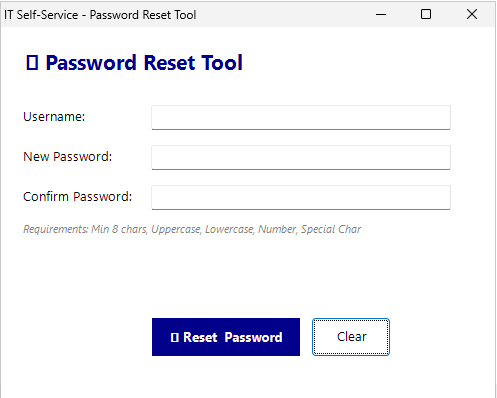
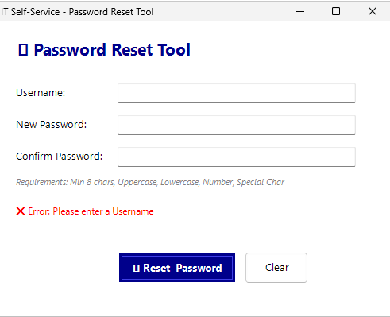
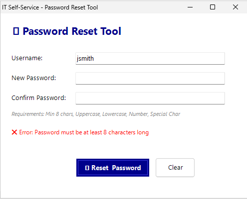
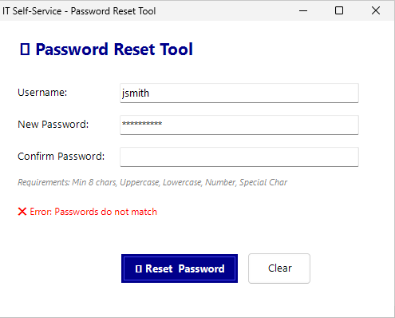
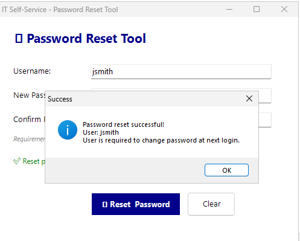
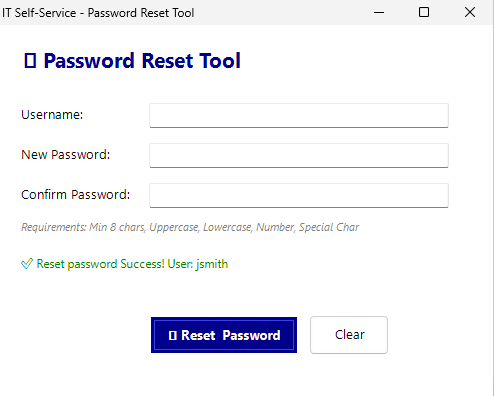
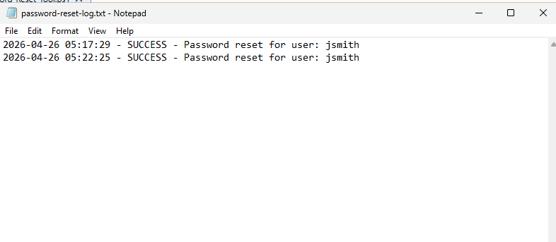

# 🔐 Lab 3: Helpdesk Password Reset Tool

> **PowerShell GUI portfolio lab** for a helpdesk operator with delegated Active Directory password-reset permissions.

---

## 📋 Table of Contents

- [Overview](#-overview)
- [Features](#-features)
- [Technologies](#-technologies)
- [Getting Started](#-getting-started)
- [Usage](#-usage)
- [Screenshots](#-screenshots)
- [Business Value](#-business-value)
- [File Structure](#-file-structure)
- [Video Demo](#-video-demo)

---

## 🎯 Overview

Lab 3 is part of an IT automation portfolio series. It provides a Windows Forms GUI that looks up an AD username, validates the two password fields, resets the password using the operator's existing AD permissions, and requires a password change at next logon.

Despite the historical “Self-Service” window title and guide filename, this is an operator tool. It has no end-user identity verification, recovery-factor flow, approval workflow, or privilege delegation service. An ordinary user cannot gain reset rights through the GUI.

**Problems solved:**
- Repeated manual password-reset steps in a disposable AD lab
- Password-entry mistakes and mismatched confirmation fields
- A need to practise helpdesk status feedback and local activity logging

No measured time saving or reduction in ticket volume is claimed.

---

## ✅ Features

| Feature | Description |
|---|---|
| 🖥️ **User-Friendly GUI** | Windows Forms interface — no PowerShell knowledge required |
| 🔒 **Password Complexity Validation** | Checks length and character classes when Reset is clicked; AD applies the effective domain policy |
| ✔️ **Confirm Password Matching** | Instant alert if the confirmation password does not match |
| 📡 **Real-Time Status Feedback** | Step-by-step status display with color-coded indicators |
| 📝 **Activity Logging** | Attempts to append timestamp, target username, and success/error to a local file; no authenticated operator ID or immutable audit trail |
| ⚠️ **Error Handling** | Graceful handling of AD unreachable, user not found, and permission denied errors |
| 🔄 **Force Password Change** | Always requests a password change at next logon; the current GUI has no toggle |

---

## 🛠️ Technologies

```
PowerShell 5.1+
├── Windows Forms (System.Windows.Forms)     → GUI Framework
├── Active Directory Module (RSAT)           → AD Integration
└── Logging System (custom)                  → Audit Trail
```

**Requirements:**
- Windows 10/11 or Windows Server 2016+
- RSAT: Active Directory Domain Services Tools
- Delegated password-reset and user-update permissions for the intended test OU; broad Domain Admin membership is unnecessary for the portfolio scenario.
- A writable `C:\Scripts` directory for the local log.

The two AD writes currently do not specify `-ErrorAction Stop`. Some failures can be non-terminating, so a GUI success message is not sufficient evidence: independently verify the account state. Password reset and the follow-up user update are not one atomic operation.

The current PowerShell character checks use case-insensitive `-match`, so the separate uppercase/lowercase tests do not reliably enforce both cases. Treat GUI validation as a lab demonstration; the effective AD password policy remains authoritative.

---

## 🚀 Getting Started

### 1. Clone or Download

```powershell
git clone https://github.com/SuriyaBoon/home-lab-v3.git
cd home-lab-v3
```

### 2. Verify Prerequisites

```powershell
# Check for AD Module
Get-Module -ListAvailable -Name ActiveDirectory

# Install RSAT if not present (Windows 10/11)
Add-WindowsCapability -Online -Name Rsat.ActiveDirectory.DS-LDS.Tools~~~~0.0.1.0
```

### 3. Set Execution Policy

```powershell
Set-ExecutionPolicy -ExecutionPolicy RemoteSigned -Scope CurrentUser
```

### 4. Run the Tool

```powershell
.\Password-Reset-Tool.ps1
```

> ⚠️ **Note:** Must be run as a Domain User with Password Reset rights or higher.

---

## 📖 Usage

1. **Launch** — Run `Password-Reset-Tool.ps1`
2. **Target User** — Enter the AD username; the GUI has no Search button or display-name lookup
3. **Set New Password** — Enter a password that meets the complexity requirements
4. **Confirm** — Re-enter the password in the Confirm field
5. **Review** — Confirm the target username; password change at next logon is always requested
6. **Reset** — Click Reset Password and wait for confirmation

The status label shows validation or operation results. Only success and caught failure paths call the local logger; input-validation failures are not logged. Check AD state and the log independently after a lab run.

---

## 📸 Screenshots

**Main GUI**



**Validation in Action**





**Success State**




**Log File**



---

## 💼 Business Value

This lab demonstrates a GUI around AD administration, basic input validation, and local logging. Timing, workload reduction, audit completeness, and production suitability have not been measured. Password reuse/history is enforced by AD policy, not by the GUI character checks.

---

## 📂 File Structure

```
lab3-password-reset/
│
├── Password-Reset-Tool.ps1        # Main script — GUI + Logic
├── User-Guide-Password-Reset.pdf  # End user guide
│
├── screenshots/
│   ├── 01-GUI-Main.png
│   ├── 02-Validation.png
│   └── 03-Success.png
│
└── README.md
```

---

## 🎥 Video Demo

▶️ [Watch Full Demo on YouTube](https://youtu.be/uzwW7So1nPI)

> Demo covers: launching the tool, searching for a user, password validation, successful reset, and log output.

---

*Part of IT Automation Lab Series — PowerShell for Real-World IT Operations*
